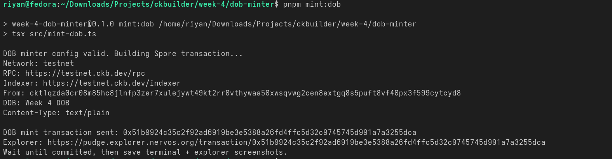

# CKB Weekly Report - Week 4

Reporting period: 8 - 14 September 2026  
Participant: Riyan Ainur  
Track: Builder

## 1. Summary

The goal of Week 4 is to move from contract deployment practice into a basic CKB application. For this weekly milestone, I selected a DOB minter using Spore Protocol on CKB Testnet (Pudge).

This week continues from Week 3, where the `hello-world` ckb-js-vm contract was successfully deployed and pushed to testnet.

## 2. Completed Milestones

### Completed

- [x] Transfer CKB
  - Completed in Week 1 on CKB Testnet.
  - Transaction Hash: `0xcfad415c6c746d8928aa7bc3b7d51b289dc272519c42d67a3cd88ba8b1dc3005`
  - Explorer Link: [View Transaction on Explorer](https://pudge.explorer.nervos.org/transaction/0xcfad415c6c746d8928aa7bc3b7d51b289dc272519c42d67a3cd88ba8b1dc3005)

- [x] Push transaction / deploy contract on testnet
  - Completed in Week 3 by deploying the Week 2 `hello-world` contract bytecode to CKB Testnet.
  - Transaction Hash: `0x9337388cc9779b6a5a15d22ad4060777c380e0b23fe7339703a837e61899f8ec`
  - Explorer Link: [View Transaction on Explorer](https://pudge.explorer.nervos.org/transaction/0x9337388cc9779b6a5a15d22ad4060777c380e0b23fe7339703a837e61899f8ec)

- [x] Create DOB (digital object)
  - Completed in Week 4 using the DOB minter scaffold in `week-4/dob-minter/`.
  - Minted a Spore/DOB on CKB Testnet (Pudge).
  - Transaction Hash: `0xfbb9e67b3123fe7ee1f529661d11475149eac7dbd762277f4c84f6e197834315`
  - Status: Committed on-chain (block `0x15600b9`)
  - Explorer Link: [View Transaction on Explorer](https://pudge.explorer.nervos.org/transaction/0xfbb9e67b3123fe7ee1f529661d11475149eac7dbd762277f4c84f6e197834315)

## 3. Week 4 Application: DOB Minter

The selected basic application is a DOB minter. The purpose is to practice creating a digital object on CKB using Spore Protocol.

### Intended User Flow

1. Configure testnet wallet/private key.
2. Provide DOB metadata:
   - name
   - description
   - content type
   - content payload or asset URI
3. Build a Spore mint transaction.
4. Sign and send the transaction to CKB Testnet.
5. Save proof of completion:
   - terminal output
   - transaction hash
   - explorer link
   - screenshot of generated DOB or app result

### Current Implementation Status

- Created a Week 4 DOB minter workspace under `week-4/dob-minter/`.
- Added environment template and usage notes.
- Added a TypeScript entrypoint that validates required configuration.
- Wired Spore SDK transaction construction, Lumos signing, and CKB Testnet RPC submission.
- Sent DOB mint transaction to Pudge: `0xfbb9e67b3123fe7ee1f529661d11475149eac7dbd762277f4c84f6e197834315`.
- Confirmed committed on-chain in block `0x15600b9` using `get_transaction`.

## 4. Key Learnings & Technical Notes

- DOBs on CKB are represented through Spore Protocol, which stores digital object data as CKB cells with protocol-defined scripts and serialization.
- CCC remains the preferred beginner-friendly SDK for wallet/client integration, but Spore minting uses Spore-specific helpers for DOB construction.
- A DOB mint must be proven by actual testnet transaction data, not just local code.
- Existing Week 3 testnet deployment proves the environment can push transactions to Pudge.

## 5. Challenges & Resolutions

- The next task is not just another contract deployment; it requires using Spore Protocol conventions for DOB data and cell structure.
- To avoid claiming incomplete work, the Week 4 report separates completed basic exercises from remaining planned items.
- Completed the intermediate Script Development Course and recorded the covered class list below.

## 6. Intermediate Script Development Course Status

Status: Completed.

The Script Development Course theoretical track was completed this week. Covered classes:

- [x] Class 1: Validation Model
- [x] Class 2: Script Basics
- [x] Class 3: UDT
- [x] Class 4: WebAssembly on CKB
- [x] Class 5: Debugging
- [x] Class 6: Type ID
- [x] Class 7: Advanced Duktape Examples
- [x] Class 8: Performant WASM
- [x] Class 9: Cycle Reductions in Duktape Script
- [x] Class 10: Language Choices

## 7. Plan for Next Step

- Use the completed script development theory as background for more advanced CKB application work.
